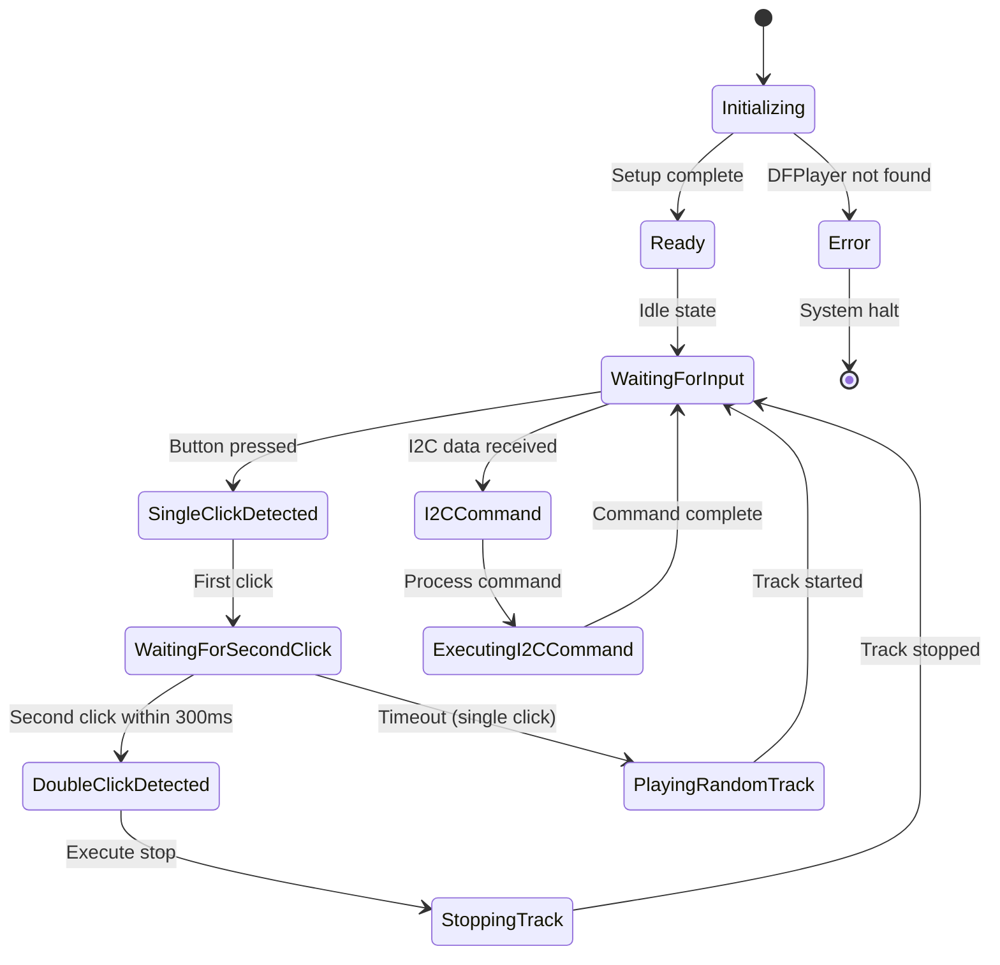

# SoundController - Program Flow Chart

## Main Program Flow

```mermaid
flowchart TD
    A[🚀 START - setup()] --> B[📊 Initialize Serial 9600 baud]
    B --> C[🎵 Initialize DFPlayer Mini]
    C --> D{DFPlayer found?}
    D -->|❌ No| E[💥 ERROR: DFPlayer not found]
    E --> F[⏹️ STOP - Endless loop]
    D -->|✅ Yes| G[🔊 Set volume]
    G --> H[📌 Configure input pins]
    H --> I[📡 Initialize I2C slave]
    I --> J[✅ Setup complete]
    J --> K[🔄 MAIN LOOP - loop()]
    
    K --> L[🔘 Check button status]
    L --> M{Button pressed?}
    M -->|❌ No| N[⏰ Check double-click timeout]
    M -->|✅ Yes| O[📝 Increment click counter]
    
    O --> P{First click?}
    P -->|✅ Yes| Q[⏳ Wait for second click]
    P -->|❌ No| R{Second click in time?}
    
    R -->|✅ Yes| S[⏹️ DOUBLE CLICK - Stop track]
    R -->|❌ No| T[🎲 SINGLE CLICK - Random track]
    
    N --> U{Timeout reached?}
    U -->|✅ Yes| T
    U -->|❌ No| V[⏱️ Wait 10ms]
    
    S --> W[🧹 Reset click counter]
    T --> W
    Q --> V
    W --> V
    V --> K
    
    style A fill:#4CAF50,stroke:#2E7D32,color:#fff
    style F fill:#F44336,stroke:#C62828,color:#fff
    style S fill:#FF9800,stroke:#F57C00,color:#fff
    style T fill:#2196F3,stroke:#1565C0,color:#fff
    style K fill:#9C27B0,stroke:#6A1B9A,color:#fff
```

## I2C Interrupt Handling

```mermaid
flowchart TD
    A[📡 I2C Interrupt - receiveEvent()] --> B{Data available?}
    B -->|❌ No| C[⚠️ WARNING: No data]
    B -->|✅ Yes| D[📥 Read command byte]
    
    D --> E{Command = ?}
    
    E -->|1| F[🎲 Play random track]
    E -->|2| G[⏹️ Stop playback]
    E -->|3| H[⏸️ Pause playback]
    E -->|4| I[▶️ Resume playback]
    E -->|5| J[🔊 Volume up]
    E -->|6| K[🔉 Volume down]
    E -->|10-14| L[🎯 Play specific track]
    E -->|other| M[❓ Unknown command]
    
    F --> N[🧹 Clear buffer]
    G --> N
    H --> N
    I --> N
    J --> N
    K --> N
    L --> N
    M --> N
    C --> N
    
    N --> O[🔚 Interrupt end]
    
    style A fill:#9C27B0,stroke:#6A1B9A,color:#fff
    style M fill:#FF5722,stroke:#D84315,color:#fff
    style O fill:#607D8B,stroke:#37474F,color:#fff
```

## DFPlayer Functions

```mermaid
flowchart LR
    A[🎵 DFPlayer Functions] --> B[🎲 playRandomTrack()]
    A --> C[⏹️ stopCurrentTrack()]
    
    B --> D[🎯 Select random track 1-5]
    D --> E[🎵 speaker.play(trackNumber)]
    
    C --> F[🛑 speaker.stop()]
    
    style A fill:#4CAF50,stroke:#2E7D32,color:#fff
    style E fill:#2196F3,stroke:#1565C0,color:#fff
    style F fill:#F44336,stroke:#C62828,color:#fff
```

## Button Timing Diagram

```mermaid
gantt
    title Button Click Timing
    dateFormat X
    axisFormat %L ms
    
    section Single Click
    Button Press    :0, 50
    Debounce Wait   :50, 100
    Wait for 2nd    :100, 400
    Timeout         :400, 401
    Play Random     :401, 450
    
    section Double Click
    First Press     :0, 50
    Debounce        :50, 100
    Second Press    :200, 250
    Double Detected :250, 251
    Stop Track      :251, 300
```



## System State Machine



---

**Usage:** These diagrams can be displayed directly in GitHub, GitLab, or other Markdown editors with Mermaid support.
