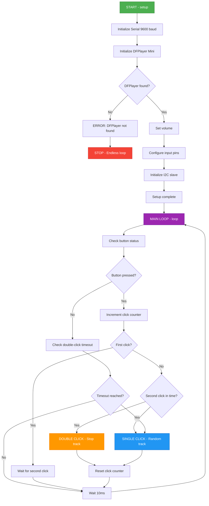
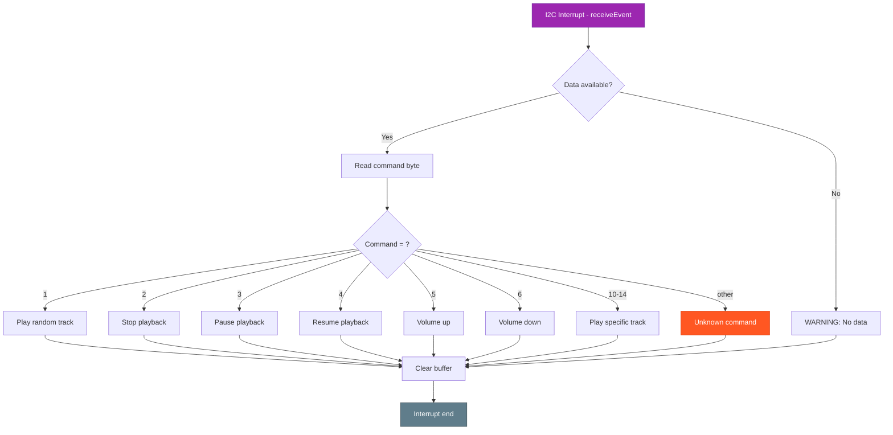
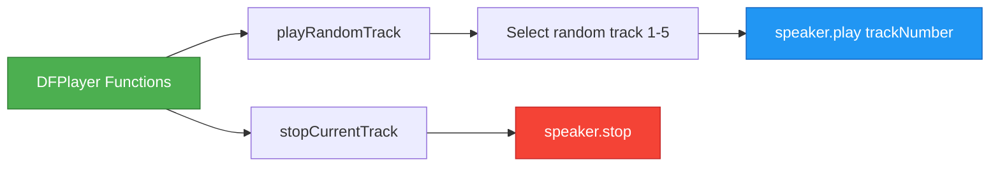
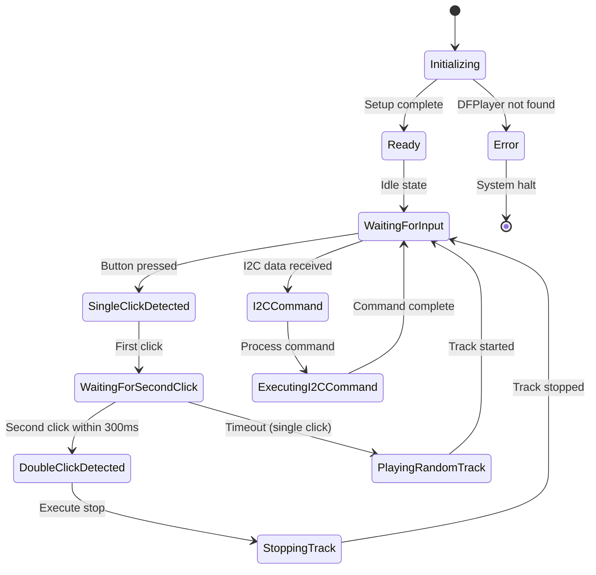

# SoundController - Program Flow Chart

## Main Program Flow

## I2C Interrupt Handling

## DFPlayer Functions

## Button Timing Diagram

```mermaid
gantt
    title Button Click Timing
    dateFormat X
    axisFormat %L ms
    
    section Single Click
    Button Press    :0, 50
    Debounce Wait   :50, 100
    Wait for 2nd    :100, 400
    Timeout         :400, 401
    Play Random     :401, 450
    
    section Double Click
    First Press     :0, 50
    Debounce        :50, 100
    Second Press    :200, 250
    Double Detected :250, 251
    Stop Track      :251, 300
```

## System State Machine

---

**Usage:** These diagrams can be displayed directly in GitHub, GitLab, or other Markdown editors with Mermaid support.
